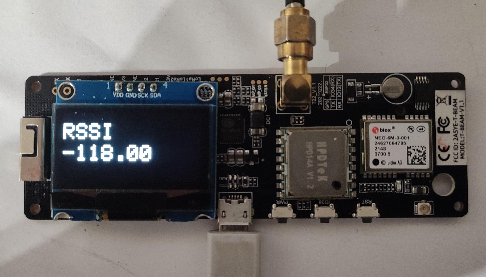

# What is it ?
A small software that allows to measure the receiver sensitivity of Lilygos modules T-beam and T3.

# Why ?
Sometimes, you can doubt of a module that seems to have receiving problems.

Injecting a signal with a known value, you can check this.

This software puts the module in receive mode and displays the RSSI value in dBm of the input signal.

# How ?
- Connect a signal generator at the antenna connector with a known value, modulated or not.
- Load the software on Visual Studio Code with PlatformIO compiler.
- Change to settings to fit to your board.
- Reboot the module that will display the RSSI value of the received signal.
  
  The noise floor (without any antenna or signal) is around -118dBm

# Settings
    #define Lilygo_Tbeam               // LilyGo T-beam board. Comment out for this board
    //#define Lilygo_T3                 // LilyGo T3 board. Comment out for this board
    //#define ssd1306                   // defines the OLED driver type comment if using SSD1306 driver. Comment if 1.3" inch uses SH1106
    double RXfreq = 433.775;            // frequency in MHz

Comment the unused lines and enter the desired frequency

The upper lines are for a T-beam module with an OLED using the SSH1106 driver.

> [!NOTE]
You must change the frequency, depending of your LoRa band supported by your LoRa module.
